# Text Analyzer CRM -Project 3: Python

Text Analyzer CRM is a contact book built with Python to explore connections between user terminal and Google sheets. It contains functionallity to print all contacts, search, add, edit and delete records.

Live site can be visited at: [Text Analyzer CRM -site](https://text-analyzer-crm.herokuapp.com/ "Text Analyzer CRM")
 
 
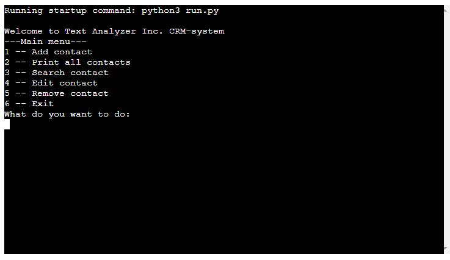
 
 

# Table of contents
* [User Experience](#user-experience-a-nameuser-experiencea)
    * [User Stories](#user-stories-a-nameuserstoriesa)
    * [Wireframes](#wireframes-a-namewireframesa)
    * [Site Structures](#site-structures-a-namesitestructuresa)
* [Features](#features-a-namefeaturesa)
    * [Start](#start-a-namestarta)
    * [Navigation Menu](#navigation-menu-a-namenavigationmenua)
    * [Print all contacts](#print-all-contacts-a-nameprintallcontactsa)
    * [Add contact](#add-contact-a-nameaddcontacta)
    * [Search contact](#search-contact-a-namesearchcontacta)
    * [Edit contact](#edit-contact-a-nameeditcontacta)
    * [Remove contact](#remove-contact-a-nameremovecontacta)
    * [Exit](#exit-a-nameexita)
    * [Google sheets](#google-sheets-a-namegooglesheetsa)
    * [Future Features](#future-features-a-namefuturefeaturesa)
* [Technologies Used](#technologies-used-a-nametechuseda)
* [Python packages](#python-packages-a-namepythonpackagesa)
* [Testing](#testing-a-nametestinga)
* [Deployment](#deployment-a-namedeploymenta)
* [Credits](#credits-a-namecreditsa)
    * [Content](#content-a-namecontenta)
    * [Media](#media-a-namemediaa)
* [Acknowledgements](#acknowledgements-a-nameacknowledgementsa)

## User Experience 

### User Stories 
* As a As a user I want to be able to navigate through the terminal interface smoothly.
* As a user I quickly want to understand the purpose of the site upon loading it.
* As a user I want to understand how to control the program.
* As a user I want to know how to contribute.
* As a user I want to know how to display and access data

[Back to top](#table-of-contents)

### Wireframes 
Some basic wireframes were created via [Lucidchart](https://www.lucidchart.com/) to guide the process of the program.

[Back to top](#table-of-contents)

### Site Structures 
Text Analyzer CRM is runing in terminal only with now graphical add ons.

[Back to top](#table-of-contents)

## Features 
Text Analyer CRM is set up as a basic python project with the ambition to include a few different functionalities to learn about and test Python.

### Start 

### Navigation menu 
As seen above the main navigation menu contains six choices and the user is asked for number input to move on.
 
[Back to top](#table-of-contents)

### Add contact 
With input 1 user ends up adding a new contact. In this example following columns are being used: Company name, First name, Last name, Email and Phone. When hitting enter this information is updating the spreadsheet. Giving the feedback "New Customer record added successfully" and then user is sent back to main menu.
 
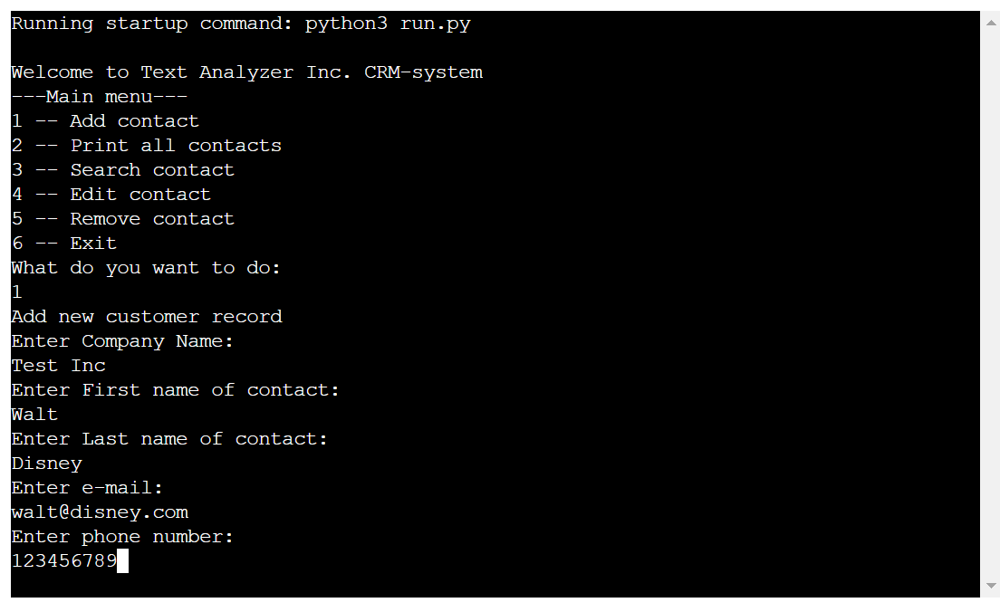
 
[Back to top](#table-of-contents)
 

### Print all contacts 
With input 2 user will get a print out in the terminal of all records. Using tabulate function to present data in a more easy-to-read format.
 
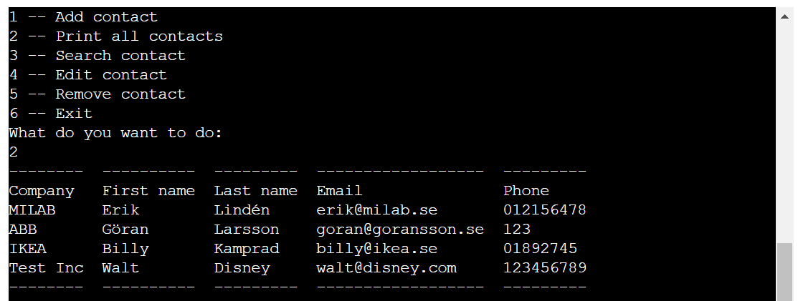
 
[Back to top](#table-of-contents)
 

### Search contact 
With input 3 user will be able to search in all content of the database and rows with a matching result will be printed to the terminal. Also a question wether user wish to make a new search or not is displyed.
 
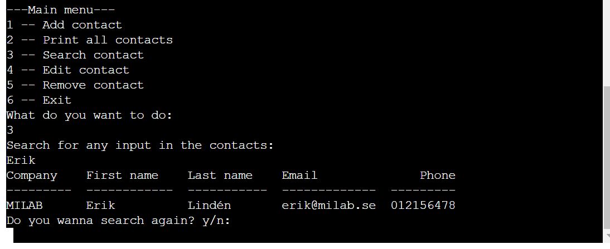
 
[Back to top](#table-of-contents)
 

### Edit contact 
With input 4 edit contact will take the user to search for a Company record. If a hit this will be indexed with the row and printed to the terminal. User will get the question if to proceed with the record, search again or exit to main menu.
If "c" for continue is choosen the user is asked for the index of the record they wish to edit, this is if several records are in the search results. Then a new menu will pop up with what data to be edited, and then the input for corrected entry is given.
 
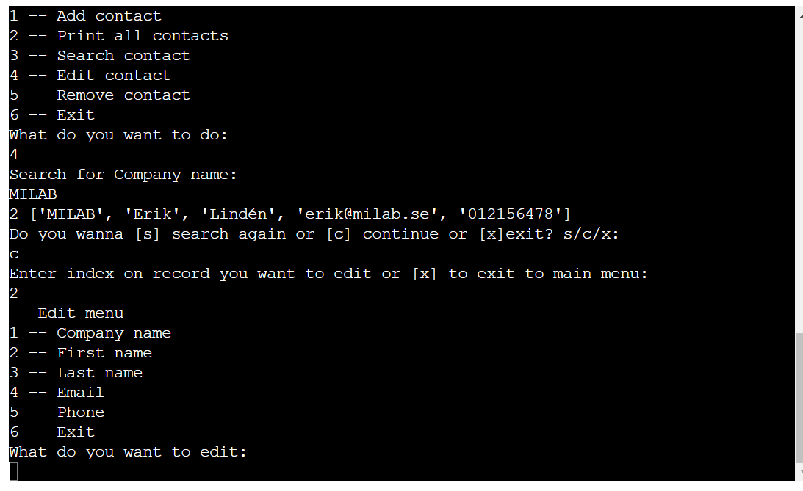
 
[Back to top](#table-of-contents)
 

### Remove contact 
With input 5 edit contact will take the user to search for a Company record. If a hit this will be indexed with the row and printed to the terminal. User will get the question if to proceed with the record, search again or exit to main menu.
If "c" for continue is choosen the user is asked for the index of the record they wish to remove, this is if several records are in the search results. Record will then be deleted in the database, feedback given to user and then redirects to main menu.
 

 
[Back to top](#table-of-contents)
 

### Exit 
With input 6 program shuts down with a thank you message.
 
[Back to top](#table-of-contents)
 

### Google sheets 
Spreadsheet via Google sheets.
 
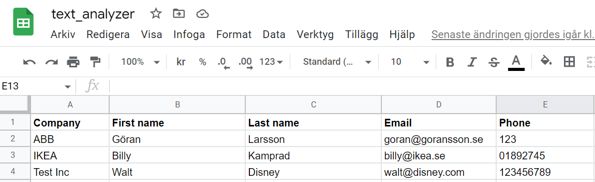
 
[Back to top](#table-of-contents)
 

### Future Features 
Some possible improvements but not limited to:

* Build functionality to document customer interaction
* Re-build to re-use more code, especily on the Edit contact function.
* Add graphical elements

[Back to top](#table-of-contents)

## Technologies Used 

* Python - used to build functions
* Google sheets - used for hosting application data
* Lucidchart - used for wireframing and planning
* Gitpod - used to deploy the website.
* Github - used to host and edit the website.

[Back to top](#table-of-contents)

## Python packages 

* GSpread - used to transfer data between application and Google sheets
* Tabulate - used to present data in a nice format

[Back to top](#table-of-contents)

## Testing 

### Code validation
For pep8 validation Code Institute validator was used: https://pep8ci.herokuapp.com/.

**Please note** The two bare except are in this case accepted.

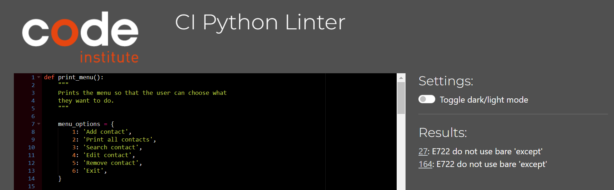

### Manual testing

#### Main menu
- Testing for valid input 1-6
- Testing invalid input and feedback to user

#### Add contact
- Test that it accepts all inputs
- Verify successmessage to user
- Verify sheet update

#### Search contact
- Validate inputs at each stage
- Validate message to user
- Test that user can search again or go back to menu
- Validate tabulate format

#### Edit contact
- Validate inputs at each stage
- Validate message to user
- Test that user can search again or go back to menu
- Test each cell update
- Validate sheet update

#### Remove contact
- Validate inputs at each stage
- Validate message to user
- Test that user can search again or go back to menu
- Validate index function
- Validate sheet updated

#### Exit
- Validate that program gives thank you message
- Validate program shut down

### Bugs fixed
Took some time to study results from validation and understand each of them.

- Added extra row before new function
- Removing several trailing whitespaces
- Fixed too long rows with \

### Bugs unresolved
As this is a training project a more consistent way of validating input would have been choosen if I was to rebuild. As mentioned above when validating the "bare except" is an example of how I choose to validate my main menu and edit menu.

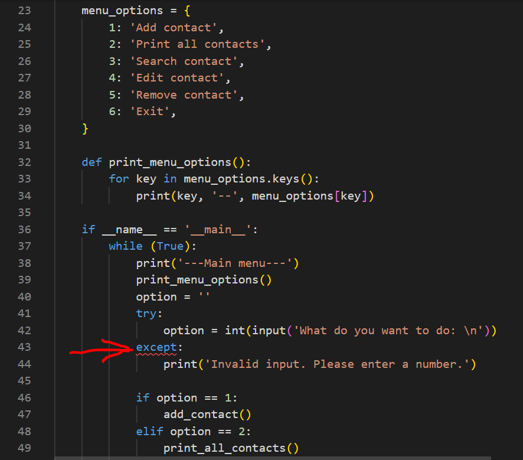

[Back to top](#table-of-contents)

## Deployment 

The site was deployed to Heroku. The steps to deploy a site are as follows:

1. Create or Log in to your Heroku account and click **new** and **Create new app**.
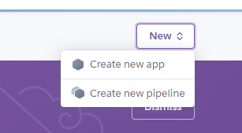
2. Give you app a unique **name** and choose your **region**
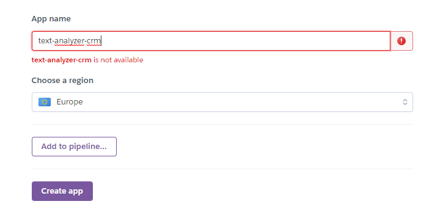
3. Go to settings and cklick reveal config vars. In the KEY input field, enter "PORT" and in the VALUE input field, enter "8000". After that, click the "Add" button to the right.
4. Scroll down and click **Add buildpacks**. First add **Python** and the **NodeJS**, make sure they end up in the order with Python on top.
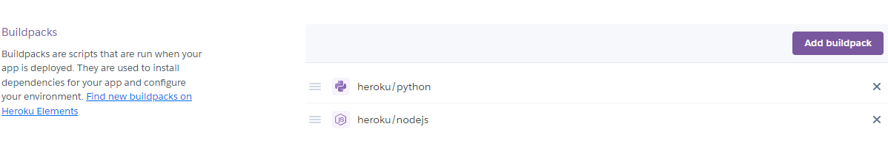
5. Click on menu tab for **Deploy** and choose method to deploy. This project is connected to GitHub.
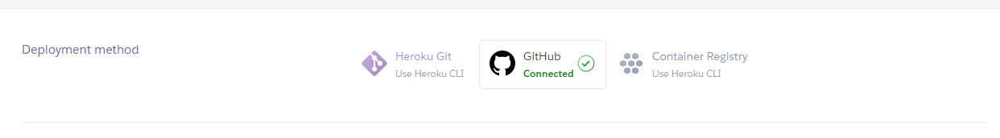
6. Choose manual or automatic deployment. This project has **automatic deployment**.
7. Click **Deploy branch**

This is the link to the live Github repository: https://github.com/Sherkaerka/text-analyzer

[Back to top](#table-of-contents)

## Credits 

### Content 
Used various forums to find different apporoaches to solve problems, as sometimes this can also be confusing. Mainly [Stackoverflow](https://stackoverflow.com/) and [W3 Schools](https://www.w3schools.com/).
[Lucidcart](https://www.lucidchart.com/) first time using lucidchart and it was an equal training for me in the process of planning my project as to use the tool.

[Back to top](#table-of-contents)

## Acknowledgements 

Text Analyzer CRM is a non-profit no money involved site that was developed as Milestone Project no3 for [Code Institute](https://codeinstitute.net "Code Institute").

Thanks to my mentor [Precious Ijege](https://www.linkedin.com/in/precious-ijege-908a00168/) for unvaluable guidance and tips.

Erik Lindén 2022

[Back to top](#table-of-contents)